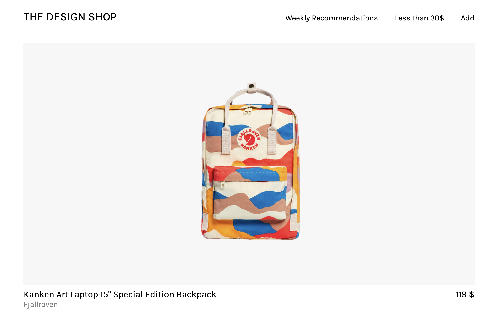

# Bootcamp Exercise - The Design Shop - Backend Connection to a Database

## Table of contents

- [Overview](#overview)
  - [The challenge](#the-challenge)
  - [Screenshot](#screenshot)
  - [Links](#links)
- [My process](#my-process)
  - [Built with](#built-with)
  - [What I learned](#what-i-learned)
  - [Continued development](#continued-development)

## Overview

### The challenge

Users should be able to:

- Build an online shop 
- Connect the shop with an database server (MongoDB)
- Make it possible to add new products to the shop
- Optimize for desktop and mobile devices

### Screenshot

### Links

- Solution URL: [https://thedesignshop.herokuapp.com/]

## My process

### Built with

- Semantic HTML5 markup
- SCSS
- Flexbox
- Grid
- JavaScript
- Node.js
- MongoDB
- EJS
- Formidable
- Dotenv
- Express

### What I learned

I worked on this project before but so far it was only frontend based with no connection to an online server or database. So until now it wasn't dynamic. Now I rebuild the project from a backend perspective and conncted the project with a database and made it possible to add new products to the shop. This happens by reading out a from on the addProduct page. 

Display a random range of products on the addProduct page was another challenge and also how to highlight a hero image in the main page product overview. 

Another interesting part was to use Dotenv to hide all sensitive information. As always I very much enjoyed working with SCSS and in this case with partials from EJS. 

### Continued development

The next step will be to upload the project on Heroku. There are still ways to optimize the overall look of the page. E.g. I want to implement a mobile menu and simplify the SCSS code. Another point would be to optimize the functions in the index.js. 

